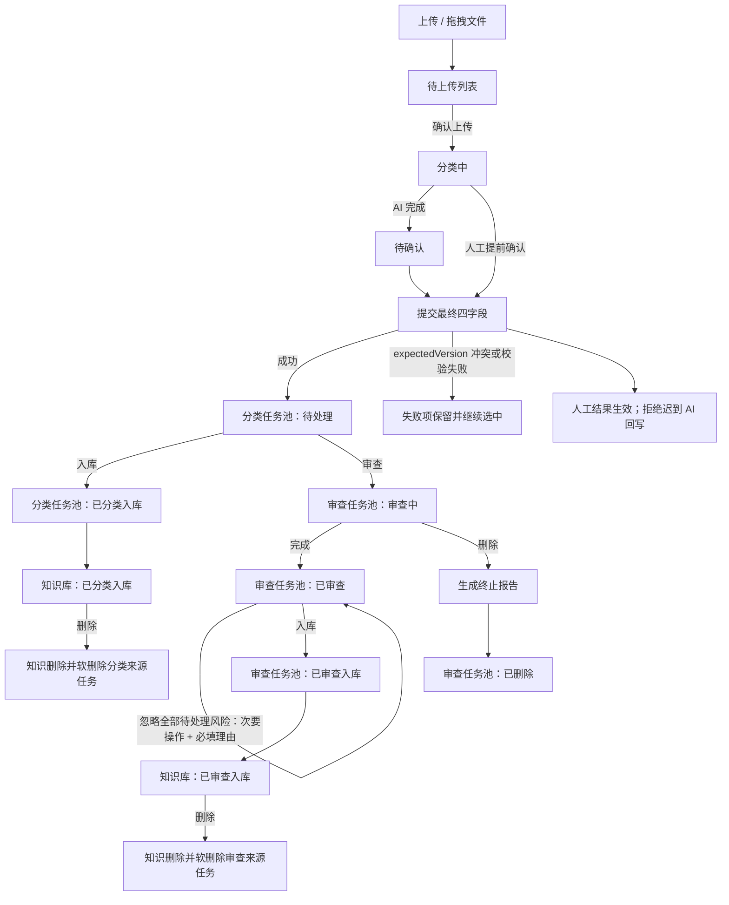

# ProofSpace 状态流程与后端接口约定

## 业务流程



## 合同专项审查验证链路

当前产品最终流程仍然是：

```text
统一上传 → 文件分类 → 根据文件类型进入对应处理流程
```

合同审查页面是从上述流程中单独抽出的条款级专项审查验证链路，用于独立验证合同解析、原文定位、风险处置、修订和报告能力。当前合同入口无需先经过文件分类，但这不是最终信息架构。

- 用户界面继续保留“文件分类审查”和“合同审查”的现有一级、二级标题。
- 页面不展示“测试链路、模拟服务、接口占位”等开发说明。
- 合同专项审查完成后进入公共知识库，知识条目标记为“合同审查入库”。
- 合同任务不重复进入通用审查任务池。
- 正式统一上传实施时，再统一调整标题、导航、流程文档和路由说明。

## 页面状态与操作矩阵

| 页面 | 状态 | 操作（固定顺序：查看 → 状态变更 → 删除） |
|---|---|---|
| 文件分类 | 分类中 | 预览、确认、删除 |
| 文件分类 | 待确认 | 预览、确认、删除 |
| 分类任务池 | 待处理 | 预览、入库、审查、删除 |
| 分类任务池 | 已分类入库 | 预览 |
| 分类任务池 | 已进入审查 | 预览 |
| 分类任务池 | 已删除 | 预览 |
| 审查任务池 | 审查中 | 查看进度、删除 |
| 审查任务池 | 已审查 | 查看报告、入库、删除 |
| 审查任务池 | 已审查入库 | 查看报告 |
| 审查任务池 | 已删除 | 查看报告 |
| 知识库 | 已分类入库 | 预览、删除 |
| 知识库 | 已审查入库 | 查看报告、删除 |
| 知识库 | 合同审查入库 | 查看合同报告、删除 |

行操作统一为纯图标，桌面通过 `title` 提示，所有尺寸通过 `aria-label` 提供可访问名称；移动端点击区域不小于 44px。批量操作仅作用于当前页，保留“图标 + 文字”。

## 并发与批量约定

- 每个确认项提交 `name`、`type`、`level`、`category`、`manualOverride` 和 `expectedVersion`。
- 整批命令必须携带 `idempotencyKey`，服务端用它避免重复执行。
- 批量接口逐项返回 `succeeded` 与 `failed`。成功项离开当前页；失败项保留、继续选中并显示 `code/message`。
- 人工确认成功后形成最终分类结论。任何针对旧 `expectedVersion` 的 AI 回写都必须拒绝。
- 文件、任务和知识删除均为软删除；知识库列表和智能问答只能读取未删除、正式入库的知识。
- 审查中删除必须先生成终止报告，至少记录终止进度、已发现风险、操作人和时间。

## 应用服务边界

页面只依赖 `AppServices`，不直接拼接后端 URL：

```ts
interface AppServices {
  auth: AuthApi;
  dashboard: DashboardApi;
  classification: ClassificationWorkflowApi;
  classificationTasks: ClassificationTaskPoolApi;
  reviewTasks: ReviewTaskPoolApi;
  contractReview: ContractReviewApi;
  documents: DocumentRepository;
  knowledge: KnowledgeApi;
  chat: ChatApi;
}
```

当前绑定共享 Mock Store。真实后端接入时，在 `src/app/services.ts` 组合根替换 adapter，并为网络响应增加运行时 schema 校验；页面、表格和表单接口无需改变。

## 路由

- 文件分类：`/file-classification`
- 分类任务池：`/classification-tasks`
- 审查任务池：`/review-tasks`
- 审查报告：`/review-tasks/[taskId]/report`
- 旧 `/classification-task`、`/review-task` 使用永久重定向，查询参数由 Next.js 保留。
